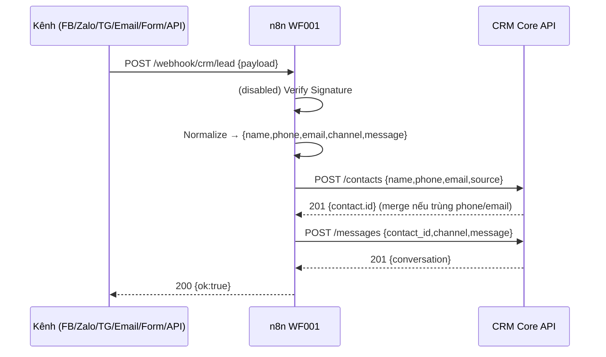
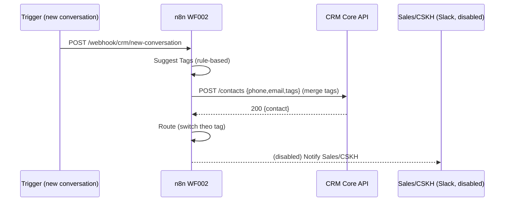
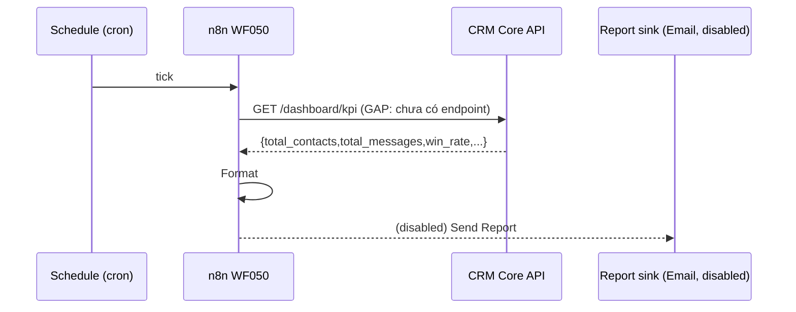

# Automation n8n — Sequence & Data-flow (PRD-003)

## 1. Sequence — WF001 Lead Ingestion


## 2. Sequence — WF002 Auto-Tag & Routing


## 3. Sequence — WF050 KPI Sync


## 4. Data-flow tổng
```
[6 Kênh] --payload--> (WF001 normalize) --> [CRM: contacts/conversations]
                                   |
              (WF002) tag+route <--+--> [CRM: contacts.tags] --> [Sales/CSKH]
                                   |
              (WF050) <----- cron -+--> [CRM: kpi] --> [Report]
```

## 5. Hợp đồng dữ liệu (data contract)
| Bước | Trường | Nguồn |
|---|---|---|
| Ingest | name, phone, email, channel, message | payload kênh |
| Contact | id, source, tags | CRM `/contacts` |
| Conversation | contact_id, channel, message, timestamp | CRM `/messages` |
| KPI | total_contacts, total_messages, win_rate | CRM `/dashboard/kpi` (gap) |

## 6. Ranh giới lỗi (fault boundary)
Mỗi HTTP node là 1 ranh giới: lỗi được cô lập, không làm hỏng cả run (Continue On
Fail) → nhánh error/retry (xem runbook).
