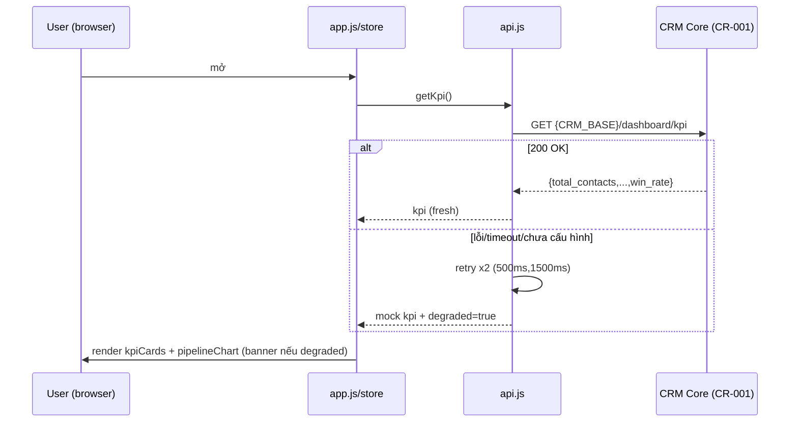

# Frontend Dashboard — Sequence & Data-flow (PRD-004)

## 1. Sequence — tải & render KPI


## 2. Data-flow
```
config.js(CRM_BASE) --> api.getKpi --> store.set({kpi,degraded})
        (fallback mock/kpi.json)              |
                                    subscribe --> kpiCards / pipelineChart re-render
router(hash) --> app.mount(view) --> components
poll(POLL_MS) --> api.getKpi --> store.set --> re-render
```

## 3. Data contract (từ CR-001)
| Trường | Kiểu | Dùng ở |
|---|---|---|
| total_contacts | int | kpiCards |
| total_messages | int | kpiCards |
| win_rate | float | kpiCards |
| pipeline_by_stage | object<int> | pipelineChart |

## 4. Error handling (chi tiết ở TechSpec §7)
fetch fail → retry x2 backoff → mock fallback + banner. Không để trắng màn. Log
`warn/error`, không log secret.

## 5. Responsive
Desktop: grid 3 cột KPI + chart rộng. Mobile (≤640px): 1 cột, nav thu gọn (hamburger).
